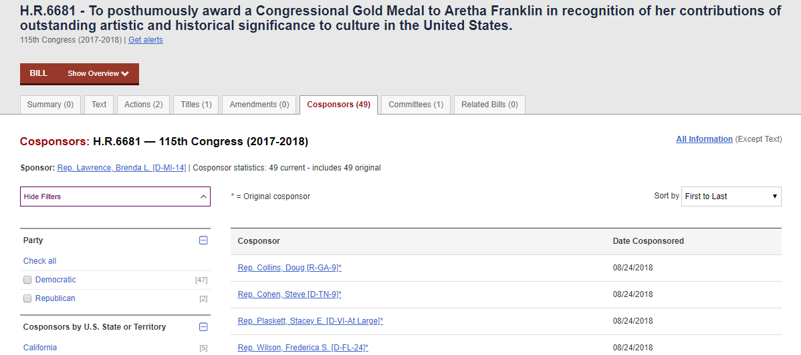
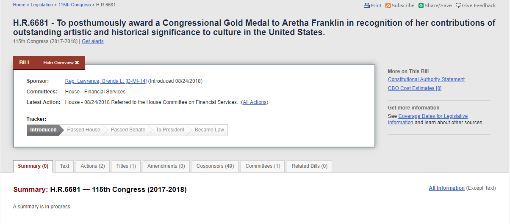

```{r setup, include=FALSE}
knitr::opts_chunk$set(echo = TRUE, warning = FALSE, message = FALSE)
```
If you have arrived here after having finished the main web scraping tutorial, great. You are ready to start this lab. If not, I highly recommend you start there first, otherwise you may feel a little lost. For the obstinate people that insist on starting here, you can load a prepackaged data set using `data('df_bills')`

I will assume you are familiar with the data set.

```{r}
# libraries
require(tidyverse)
require(rvest)
require(how2scrape)

# Load toy data set
data('df_bills')
```

# Examining the Cosponsors Typical Page

The first step for extracting the names of cosponsors is to take a look at the typical cosponsor page and see what data we want to collect. Let's filter our data frame to only include bills with sponsors and take the link from the first observation.

```{r}
df_bills %>% 
  filter(N_cosponsors > 0) %>% 
  select(cosponsors_link) %>% 
  .[1, ]
```

Pop that into your browser. Here's my view (results may vary depending on whether you are using a prepackaged or freshly scraped data set):



It looks like there are two sets of potentially useful data on this page: the names of cosponsors and their date of cosponsorship. This opens up even more opportunities for creative analyses. Not only could we do some type of cosponsorship network analysis, we could also do some time-series analysis on rates of cosponsorship by bill, legislator, etc.

The extraction process is no different that before. Using the [SelectorGadget](https://selectorgadget.com/), highlight and isolate the cosponsor names, extract them using `rvest` and do the same for the date of cosponsorship.

```{r}
# Define typical page url
# Let's use a page with 2 cosponsors
# If the CSS selector works on all the names, it should work on just one 
url <- df_bills %>% 
  filter(N_cosponsors > 1) %>% 
  select(cosponsors_link) %>% 
  .[1, ]

# Read html

html.cosponsors <- read_html(url)

# Extract cosponsor name(s)
cosponsors <- html.cosponsors %>% 
  html_nodes('#main a') %>% 
  html_text()

# Extract date of cosponsorship
date_cosponsor <- html.cosponsors %>% 
  html_nodes('td.date') %>% 
  html_text()
```

Alright, it's fairly straightforward to get the data we want. However, there are two remaining issues. First, we have two vectors of data with length greater than one which we will ultimately want to append to a single observation. We will need to decide how to collapse all this data in a way that can be intuitively expanded later (i.e. a long form data set). Second, we need to write this into a function with conditionals for one or greater cospsonsors. 

I have provided my solution below, but there are certainly others:
```{r, eval = F}
co_extractor <- function(url) {
  # Libraries
  require(rvest)
  require(dplyr)

  # Read html
  html.cosponsors <- read_html(url)

  # Extract cosponsor name(s)
  cosponsors <- html.cosponsors %>% 
    html_nodes('#main a') %>% 
    html_text()
  
  # Extract date of cosponsorship
  date_cosponsor <- html.cosponsors %>% 
    html_nodes('td.date') %>% 
    html_text()
  
  # Paste both vectors together
  # Separate by hypen for easy string splits later
  m <- paste(cosponsors, date_cosponsor, sep = ' - ')
  
  # If N_cosponsors > 1, collapse by semi-colon for easy string split later
  # If there are no cosponsors, make NA 
  if (length(m) > 1) m <- paste(m, sep = '', collapse = '; ')
  if (length(m) == 0) m <- "No cosponsors"

  
  # return m
  # Note: I am not assigning m to global environment, because I want to 
  # use it to populate a column in another df
  return(m)
  
  # Put in a crawl-delay so we don't get timed out
  Sys.sleep(2)
}
```

With the cosponsors extracting function all set, let's turn our attention to how to extract the text of each bill.

# Examining the Bill Text Typical Page

As we did aboive, print out the link of the first bill and see what it looks like. The typical page for the bill text is quite different from the other html/javascript structures we have encountered. 

```{r, echo = F}
df_bills$text_link[1]
```


You may notice the link doesn't actually take us to the text of the bill. Instead, we end up on a summary tab. Moving over to the text tab, two things to be cognizant of: 

1. The text of the bill is located at a different url than our stored links
2. Some bills do not have their text uploaded yet. 

The first issue is potentially very troublesome. We do not want to have to write a function that redirects us from the url we have to a different url. Consider that we have 10k links to work through, if we add an extra page to each of these we are talking about 20k urls to load! That will approximately double the execution time for no reason. Such needless cycling through pages to get where we want to go puts unwanted stress on our computing resources and congress.gov's servers. Thankfully, there's an easy fix.

The links stored in our data frame and the desired links are almost identical:

> https://www.congress.gov/bill/115th-congress/house-bill/6681?r=1
> https://www.congress.gov/bill/115th-congress/house-bill/6681/text?r=1

All we need to do is use some regex to substitute a '/text' after the bill number and we are good to go. My intuition with regex tells me that we shouldn't use a solely digits-based pattern because the 115th may interfere with it. We can solve this easily with `gsub()`:

```{r, eval = F}
df_bills <- df_bills %>% 
  mutate(text_link = gsub('(\\?)', '/text?', text_link))
```

The second issue is less computationally problematic. Except for the newest bills, the rest should have their text upload. Nonetheless, we can't be sure this is true and we don't want to waste time extracting useless text. We need to find an intuitive and consistent proxy for whether a bill has text or not and, eventually, write this into a conditional statement in our text extracting function. 

I solved this by comparing bills with and without text. On the pages of those with text, there are parentheses with a digit (usually 1) in the text tab. On the pages without text, this feature is absent. I will use this as a proxy. By now, you should have the hang of how I to write a scraping function, so for the sake of space, I'll skip the preliminary steps and provide my text scraping function.

```{r, eval = F}
text_extractor <- function(url) {
  
  # Libraries
  require(rvest)
  require(dplyr)
  require(stringr)
    
  # Read html
  html <- read_html(url)
  
  # Create logical proxy for presence of text
  proxy <- html %>% 
    html_nodes('.selected a') %>% 
    html_text() %>%
    grepl('\\(',.)

  # If proxy is TRUE, extract text, otherwise set to NA
  if (proxy) {
    
    # Extract text
    text <- html %>%
      html_nodes('.generated-html-container') %>% 
      html_text() %>%
      # Split into meaningful parts
      str_split(., '\n{2}') %>%
      .[[1]] %>% 
      # Drop blank elements
      .[. != ''] %>% 
      # Drop everything prior to start of main text
      .[-(1:grep('BILL', .)[1])] %>% 
      # Drop everyhing after end of main text
      {if (any(grepl('BILL',.))) .[-(grep('Calendar No.', .):length(.))] else .} %>% 
      # remove excess white space in text
      str_replace_all('[\n\t]', '')
  } else {
    text <- "No text available"
  }
  
  return(text)
  
  # Put in a delay so we don't get timed out
  Sys.sleep(2)
}
```

Most of the function consists of string cleaning commands. The resulting text will still be a bit unstructured/messy due to variation across each bill, but it should get us close to what we want. With both these functions in place, we can move to the actual scraping process. 

Unlike the initial bill scrape, this is a much larger operation due to the total number of pages. If we tried to execute this by sequentially mapping the two functions over their respective list of links, it would take approximately `r {round((2 * nrow(df_bills) * 1.5) / 3600, 2)}` hours (assuming 1.5 sec/link)! And that's a minimal estimate... To speed things up, I utilized a suite of parallel processing packages---`foreach`, `doParallel`, and `parallel`---and sent the script to the [BSOS HPC cluster](https://oacs.umd.edu/oacs-cloud/bsos-high-performance-computing-cluster). I have shared the script below to give you a sense of how I set up the parallel operations.

```{r, eval = F}
rm(list=ls(all=T))

# load bills df

load('YOUR DIRECTORY HERE/df.RData')

# Libraries

  require(rvest)
  require(dplyr)
  require(stringr)

# Fix text urls

df_bills <- df_bills %>% 
  mutate(text_link = gsub('(\\?)', '/text?', text_link))

# Cosponsor extracting function

  co_extractor <- function(url) {
    # Libaries
    require(rvest)
    require(dplyr)
  
    # Read html
    html.cosponsors <- read_html(url)
    
    # Extract cosponsor name(s)
    cosponsors <- html.cosponsors %>% 
      html_nodes('#main a') %>% 
      html_text()
    
    # Extract date of cosponsorship
    date_cosponsor <- html.cosponsors %>% 
      html_nodes('td.date') %>% 
      html_text()
    
    # Paste both vectors together
    # Separate by hypen for easy string splits later
    m <- paste(cosponsors, date_cosponsor, sep = ' - ')
    
    # If N_cosponsors > 1, collapse by semi-colon for easy string split later
    # If N_cosponsors = 0, set to "No cosponsors"
    if (length(m) > 1) m <- paste(m, sep = '', collapse = '; ')
    if (length(m) == 0) m <- "No cosponsors"
    
    return(m)
    
    # Put in a crawl-delay
    Sys.sleep(2)
  }

# Text extracting function
  
  text_extractor <- function(url) {
    
    # Libraries
    require(rvest)
    require(dplyr)
    require(stringr)
    
    # Read html
    html <- read_html(url)
    
    # Create logical proxy for presence of text
    proxy <- html %>% 
      html_nodes('.selected a') %>% 
      html_text() %>%
      grepl('\\(',.)
    
    # If proxy is TRUE, extract text, otherwise set to "No text available"
    if (proxy) {
      
      # Extract text
      text <- html %>%
        html_nodes('.generated-html-container') %>% 
        html_text() %>%
        # Split into meaningful parts
        str_split(., '\n{2}') %>%
        .[[1]] %>% 
        # Drop blank elements
        .[. != ''] %>% 
        # Drop everything prior to start of main text
        .[-(1:grep('BILL', .)[1])] %>% 
        # Drop everyhing after end of main text
        {if (any(grepl('BILL',.))) .[-(grep('Calendar No.', .):length(.))] else .} %>% 
        # remove excess white space in text
        str_replace_all('[\n\t]', '')
    } else {
      text <- "No text available"
    }
    
    return(text)
    
    # Put in a delay so we don't get timed out
    Sys.sleep(2)
  }

# Parallel Processing Libraries

  library(foreach)
  library(parallel)
  library(doParallel)

# Set number of cores to 4

  n_cores <- 4

# Make cluster of cores

  cl <-  makeCluster(n_cores, type = "FORK", outfile = 'debug.txt') 

# Register the cluster
  
  registerDoParallel(cl)

# Create class which holds multiple results for each loop iteration.
# Each loop iteration populates two properties: $result1 and $result2.
# For a great tutorial on S3 classes, see: 
# http://www.cyclismo.org/tutorial/R/s3Classes.html#creating-an-s3-class

  multiResultClass <- function(result1=NULL,result2=NULL)
  {
    me <- list(
      list(result1),
      list(result2)
    )
    
    ## Set the name for the class
    class(me) <- append(class(me),"multiResultClass")
    return(me)
  }

# Parallel loop over the cosponsor_links and bill text to extract
# respective data
  
  bill_container <- foreach(i = 1:nrow(df_bills)) %dopar% {
    result <- multiResultClass()
    result[[1]] <- co_extractor(df_bills$cosponsors_link[i])
    result[[2]] <- text_extractor(df_bills$text_link[i])
    return(result)
  }

# Stop cluster

  stopCluster(cl)

# Save result

  save(bill_container, 
       file = '/a/ha-nfs-2-ib/export/data/bswift-1/eajones3/result.RData')
```

[Return to 'An Introduction to Web Scraping'](main_lab.html)