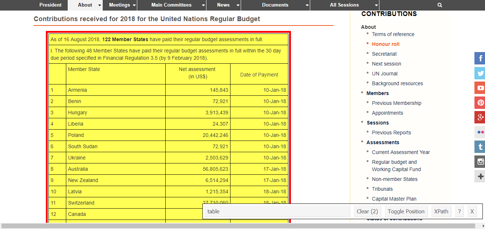

```{r setup, include=FALSE}
knitr::opts_chunk$set(echo = TRUE, warning = F, message = F)
```

Scraping information from a single web page is easy. To illustrate, I will use the [2018 United Nations Member Contributions](http://www.un.org/en/ga/contributions/honourroll.shtml) web page as an example.

First, let's fire up R and load some helpful packages.

```{r}
# Libraries

  # HTML parser
  require(rvest)

  # Data manipulation
  require(tidyverse)
  require(magrittr)

  # Working with dates
  require(lubridate)

  # Produce markdown tables
  require(knitr)
  require(kableExtra)
```


Now we can read in the web page with  `read_html()` function from rvest.


```{r}
html.un_contributions <- read_html('http://www.un.org/en/ga/contributions/honourroll.shtml')
```


Using the SelectorGadget we want to highlight only the table with information we seek to extract. This will most likely be part of a 'table' node class. You may have to click around a little to isolate the table.





The information is indeed stored in the 'table' node. Now all we have to do is point `rvest` towards this node. `rvest` will read this in as a list of tables and we'll have to extract each data frame individually.


```{r}
# Tell rvest to read in data from the 'table' node and extract the first table

df.un_contributions <- html.un_contributions %>% 
  html_nodes('table') %>% 
  .[[1]] %>% 
  html_table()

# Preview table

df.un_contributions %>% 
  kable() %>% 
  kable_styling(bootstrap_options = c('striped', 'hover', 'condensed'),
                font_size = 12) %>% 
  scroll_box(width = '100%',
             height = '350px')
```


The data frane contains unwanted text, so we'll have clean it up a bit. Nonetheless, `rvest` has done the bulk of the heavy lifting for us. Let's tidy things up.

*Note: I like the %<>% pipe operator from* `magrittr` *to modify data frames in place and make my code cleaner. However, this can be dangerous/annoying if you make a mistake and overwrite your object. Use at your own discretion.*


```{r}
# Remove unwanted attributes of the df, rename columns, and convert numbers and dates into malleable
# classes

df.un_contributions %<>% 
  # Drop rows 51 and 52 indicating late payers
  slice(-(51:52)) %>% 
  # Drop the last row, it's empty
  slice(-nrow(.)) %>% 
  # Drop the first two rows
  slice(3:nrow(.)) %>% 
  # Drop the first column
  select(-X1) %>% 
  # Rename the columns
  rename(member_state = X2,
         net_assessment = X3,
         payment_date = X4) %>% 
  # Modify columns to make them more R-friendly
  mutate(net_assessment = as.numeric(gsub(',', '', net_assessment)), # remove commas and convert to numeric
         payment_date = dmy(payment_date))  # convert from character to date class

# Create late_payment dichotomous variable = 1 for all payments after 9-Feb-18

cutpoint <- ymd('2018-2-09')

df.un_contributions %<>% 
  mutate(late_payment = ifelse(payment_date > cutpoint, 1, 0)) 
  

# Preview the final df

df.un_contributions %>% 
  kable() %>% 
  kable_styling(bootstrap_options = c('striped', 'hover', 'condensed'),
                font_size = 12) %>% 
  scroll_box(width = '100%',
             height = '350px')
```


Voila! We now have a malleable data frame that we can use for analysis or merging with another data set. For more practice, try cleaning up the monthly contributions data frame on your own. Below is some code to get you started:


```{r}
# Extract second table

df.un_contributions_monthly <- html.un_contributions %>% 
  html_nodes('table') %>% 
  .[[2]] %>% 
  html_table()
```


If you are not familiar with the packages I used, here are some cheat sheets:

1. [dplyr](../images/data-transformation.pdf) (in the tidyverse)
2. [lubridate](../images/lubridate.pdf)
3. [kable/kableExtra](https://cran.r-project.org/web/packages/kableExtra/vignettes/awesome_table_in_html.html#table_footnote)

[Return to 'An Introduction to Web Scraping'](main_lab.html)
