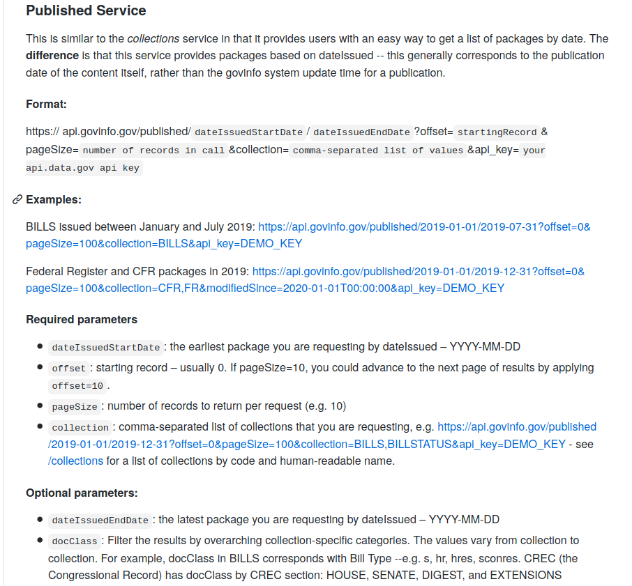

# Available Vignettes

1. [Introduction](introduction.html)
2. [Robots.txt](robots.html)
3. [A Simple Scraping Exercises](simple_scrape.html)
4. [Web Scraping](web_scraping.html)
5. [How to Extract Bill Cosponsors and Text](cosponsors.html)


```{r setup, include=FALSE}
knitr::opts_chunk$set(echo = TRUE, warning = FALSE, message = FALSE, cache = TRUE)
```

In the [Web Scraping](web_scraping.html) section I showed how to scrape Congressional Bills, but did so directly from [www.congress.gov](www.congress.gov), unaware of the fact that there was an API. In this lab, I provide a step-by-step tutorial on how to interact with the GPO bulk data repository using its API.

# What is an API?

From [Wikipedia](https://en.wikipedia.org/wiki/API):

> An application programming interface (API) is a computing interface which defines interactions between multiple software intermediaries. It defines the kinds of calls or requests that can be made, how to make them, the data formats that should be used, the conventions to follow, etc. It can also provide extension mechanisms so that users can extend existing functionality in various ways and to varying degrees.[1] An API can be entirely custom, specific to a component, or it can be designed based on an industry-standard to ensure interoperability. Through information hiding, APIs enable modular programming, which allows users to use the interface independently of the implementation.

The above definition makes clear that the term API is all-encompassing and not specific to web scraping per se. The key for something to qualify as an API is that is abstracts the underlying implementation away and only exposes objects or actions the developer (researcher) needs. 

In the case of web scraping where we are interested in the underlying database, an API acts as an interlocutor between us and the database. Rather than having to write specific SQL queries on the database to get desired information, we can utilize a url-like call to the API and it will return the data to us in a structured format--usually JSON. Below is an example of an API call to the USGPO published bills service:

[https://api.govinfo.gov/published/2019-01-01/2019-07-31?offset=0&pageSize=100&collection=BILLS&api_key=8mxegYItU22NIxI50bz7tFBNbRXYmFCvdxe8jBec](https://api.govinfo.gov/published/2019-01-01/2019-07-31?offset=0&pageSize=100&collection=BILLS&api_key=8mxegYItU22NIxI50bz7tFBNbRXYmFCvdxe8jBec)

When it comes to collecting data on the web, finding an API for your desired data is a godsend. No longer do you need to parse through ugly HTML and mess around with CSS selectors. Interfacing with most APIs entails three simple steps:

1. Request an **api key**
2. Specify a few parameters in a url-structured call, send the request, and--voila!--there's your information
3. Convert received data (usually JSON) to desired structure in R

An API key is like a secret knock that let's the database know you have been verified to use it. If you do not pass these credentials to the API, your request will be denied. Most well-designed APIs will require you to register (usually for free) to receive an API. 

The call itself is usually look just like a url where you enter some parameters to narrow your search. Documentation will usually be provided by the API servicer on how to structure your calls. For instance, below is the documentation for the API we will be using:


Most APIs return data in JSON format. If you've never worked with JSON-formatted data, it is structured as lots of nested curly brackets. [Here](https://github.com/usgpo/api/blob/master/samples/packages/BILLS-115hr1625enr-summary-formatted.json) is an example of a returned call from the BILLs collection.

# The USGPO Bulk Data Repository

The US Government Publishing Office (GPO) offers a convenient [bulk data respository](https://www.govinfo.gov/bulkdata) that contains myriad documents including Congressional Bills, the Code of Federal Regulations, Public Papers of the Presidents, Supreme Court decisions, and so on. It is a treasure trove for researchers. Adding to the convenience of this one-stop shop for government documents is that the GPO provides an API for easily retrieving data. The GPO has a [developer hub](https://www.govinfo.gov/developers) page. This is a good place to start if you want to get a better sense of the full range of services the GPO offers.

# Toolkit

Before jumping into the calls, let me first talk about the "toolkit" of packages I use as there are some variations from before. I use `jsonlite::fromJSON()` for the API calls. It automatically converts JSON objects to lists, saving the user from the hassle of manipulating JSON files. The `tidyverse` packages are for run-of-the-mill data manipulation. Finally, `memoise` provides a nice way to cache the results of repeatedly used functions, speeding up computation. 

```{r, message = F, error = F, warning = F}
# Libraries
require(tidyverse)
require(jsonlite) 
require(memoise)
```

We're going to be making a lot of repetitive API calls. Let' memoise fromJSON to make them faster.

```{r}
.fromJSON <- memoise(fromJSON)
```

Okay, now that we have a framework for interacting with APIs, have familiarized ourselves with the USGPO offerings, and discussed tools, let's jump in.

# Making API calls

### Step 1. Requesting and Registering an API Key

To access the API, you must first request an API key from the data.gov website. Here's the [link](https://api.data.gov/signup/). The form asks for your name and email address and will send the API key to you in an email. Once you receive the key, you will need to use it to send requests to the API. There are a numerous ways to make requests:

1. Pass it directly in the command line with [curl](https://api.data.gov/docs/api-key/).
2. Manually via the [web browser](https://api.govinfo.gov/docs/) (You have to authorize the key first).
3. Directly from R using a package like `rvest` or `httr`.

Since we are doing the third way, let's write a function to register our key to the Global Environment. If we intended to call the API often or create an R package to wrap it, we would want to store the key in the `.Renviron`. Then the api key would load in the background every time we start R (see [here](https://rviews.rstudio.com/2017/04/19/r-for-enterprise-understanding-r-s-startup/) for a nice article on R's Startup). However, the global environment suffices for a one-time use.

Below is a function I wrote that you can pass an api key to and it will register it as a variable
in your global environment named `api_key`. I then used the function to register my key to the environment, but hide the code chunk so you cannot see my personal key. As general practice, avoid sharing your API key with others. You probably wouldn't let a stranger take your car for a joyride, the same applies to your API key. 
```{r}
# Function to register your key
register_apikey <- function(key = NULL) {
  # Check params
  if(is.null(key)) stop('Must supply an API key.')
  cat('List of ways to pass API key: https://api.data.gov/docs/api-key/\n',
      'OR directly register here: https://api.govinfo.gov/docs/')
  
  # Combine call parts
  api <- 'api_key='
  key <- key
  api_key <- paste0(api,key)
  
  # Assign to environment
  api_key <<- api_key
}
```
```{r, include = F}
register_apikey(key = '8mxegYItU22NIxI50bz7tFBNbRXYmFCvdxe8jBec')
```

### Step 2. Making a request

#### A Preliminary Look at the Bulk Data Repository

Before, diving into the Congressional Bills, it is nice to get a bird's-eye view of the API and see what it has to offer. Below is a function that calls and returns a data frame of all the collections that can be requested via the API, how many items are in each collection, and so on.

```{r}
# Function to show the collections
show_collections <- function(key = api_key) {
  # Collections URL
  collections_url <- 'https://api.govinfo.gov/collections'
  
  # Get collections
  call <- .fromJSON(paste(collections_url, api_key, sep="?"))
  df <- call$collections
  return(df)
}

# Show collections
require(knitr)
require(kableExtra)
show_collections() %>% 
  kable(caption = 'US GPO Bulk Data Collections') %>% 
  kable_styling(bootstrap_options = 'hover', full_width = F, 
                position = 'center', font_size = 10) %>% 
  scroll_box(width = "100%", height = "250px")
```

As you can see, there are 34 available collections including every drab document you could ever want from the US government and more. Collection document counts range from 6 for the Senate Manual to 1,412,239 for Court Opinions. The first column provides the collection code we will use in our API request (BILLS).

The GPO's [github page](https://github.com/usgpo/api) offers clear advice on how to request information from a given collection. Requests must be passed to GET in the following format:

> https://api.govinfo.gov/collections/{collection}/{startDate}?offset={#}&pagsize={#}&api_key={YOUR_KEY}

where `collection` is the collection code and `startDate` is the beginning time period of the request. `offset` will move your through pages (I set it to zero and avoid using it altogether below) and `pagesize` determines how many items are returned per request page. There is a 10000 item limit on collections responses. This means that if your update range is too broad, you may need to narrow it down using the `endDate` parameter which is paled after `startDate` separated by a /.

Note the earliest startDate is no earlier than 2017-01-01 even though the dates of the content within each collection predates this. The reason is because the packages (content) in each collection are dated according to when they were *last modified* in the database. When combined with their 10,000 item request limit, this ends up being a major flaw in my opinion and is a [known issue](https://github.com/usgpo/api/issues/19#issuecomment-428292313). 

If we wanted to scrape all the bills from the collection, we'd be limited to batches of size 10,000. This wouldn't be a huge hassle if the bills were last modified in batches over a relatively even interval. Of course, that's not the case. For example, there is a two day period (May 20, 2018 - May 22, 2018) in which 197,569 bills were modified. And within that period there are two 2-hour periods with 49,465 and 148,104 bills...

I wrote a small R package to optimize this entire process and it was a nightmare. Fortunately, the maintainers at USGPO heard our cries, saw our tears, and created a **Published Service** API that allows us to filter results based on date of publication, not when it was modified in their database. We'll use this.

The request structure is slightly different:

> https://api.govinfo.gov/published/{dateIssuedStartDate}/{dateIssuedEndDate}?offset={#}&pageSize={#}&collection={collection}&api_key={YOUR_KEY}

Let's make a call for all bills published since the start of the year and see what the output looks like.
```{r}
# Construct request
base_url <- 'https://api.govinfo.gov/published/'
dates <- paste('2020-01-01', Sys.Date(), sep = '/')
os <- paste0('?offset=', 0)
pgsize <- paste0('&pageSize=', 100)
coll <- paste0('&collection=', 'BILLS')
key_string <- paste0('&', api_key)
request <- paste0(base_url, dates, os, pgsize, coll, key_string)

# Make call
collection_request <- .fromJSON(request)
str(collection_request)
```

We can see the request is a list with 5 objects. The first tells us the number of bills in total.
The second provides any network messages related to our request, such as errors if we were to receive any. The third provides us with a link the next page of bills. There is a cap on the number of bills returned in any given call, so we must iterate through all the pages. Luckily, the request points us to the next page. The fourth object is a link to the previous page. Finally, the data were are interest in is stored in an a dataframe named `packages`. This is what we want to store at each step.

Let's write a function that will automatically iterate through all the pages and store what what want at each step.

```{r}
# Function to make call
load_collection <- function(collection, start_date = NULL, end_date = NULL, 
                            offset=0, size=100, key = api_key) {
  
  if (is.null(start_date) | is.null(end_date)) stop('Must supply start and end dates.')
  
  # Construct request
  base_url <- 'https://api.govinfo.gov/published/'
  dates <- paste(start_date, end_date, sep = '/')
  os <- paste0('?offset=', offset)
  pgsize <- paste0('&pageSize=', size)
  coll <- paste0('&collection=', collection)
  key_string <- paste0('&', key)
  request <- paste0(base_url, dates, os, pgsize, coll, key_string)
  
  # First API Call
  for (attempt in 1:10){
    try({
      # Make request
      collection_request <- .fromJSON(request)
      break #break/exit for-loop
    }, silent = T)
  }
  
  # Store outputs of interest
  request_data <- collection_request$packages
  nextPage <- collection_request$nextPage
  
  # Iterate through all pages
  while (!is.null(nextPage)) {
    
    # Make call
    collection_request <- .fromJSON(nextPage)
    
    # Update outputs
    request_data <- bind_rows(request_data, collection_request$packages)
    nextPage <- collection_request$nextPage
  }
  
  return(request_data)
}

# Bills issued starting in 2020 to current date
df_bills <- load_collection(collection = 'BILLS', start_date = '2020-01-01', end_date = Sys.Date())

# Preview bills
df_bills %>% 
  arrange(dateIssued) %>% 
  kable(caption = 'Bills Issued Since Start of 2020') %>% 
  kable_styling(bootstrap_options = 'hover', full_width = F, 
                position = 'center', font_size = 10) %>% 
  scroll_box(width = "100%", height = "250px")
```
Look at how much easier that was than trying to parse through the Congressional Website! 

### Step 3. Convert Request to Desired Form

Luckily, the fromJSON function does much of the work for us. However, parsing and concatenating the results of further calls is up to us.

Notice this data frame only contains the meta-data for each bill such as date of issue, Congress, title, type of legislation, etc. However, if we want to extract more data for each bill, we can use the `packageLink` variable and pass this to `.fromJSON()` along with our api key to get more information about each bill.

Here's an example for a single bill below.
```{r}
# Bill info
request_call <- paste0(df_bills$packageLink[1], '?', api_key)
bill_info <- .fromJSON(request_call)

# Preview
str(bill_info)
```

We see bill_info is a list with 30 different pieces of information about each bill. There are multiple ways we could go about this depending on our needs. One crude approach would be to store the output of each call as an entry in a `list-column` in our `df_bills` data frame and then pull out information as needed later. Otherwise, if you knew *a priori* which information you wanted about each bill, you could write a function to make the api request, extract just the need information, and append this to each row of `df_bills`. Either way, I leave that up to you to explore since I've covered how to work with the API.

[Return to 'Web Scraping'](web_scraping.html)
