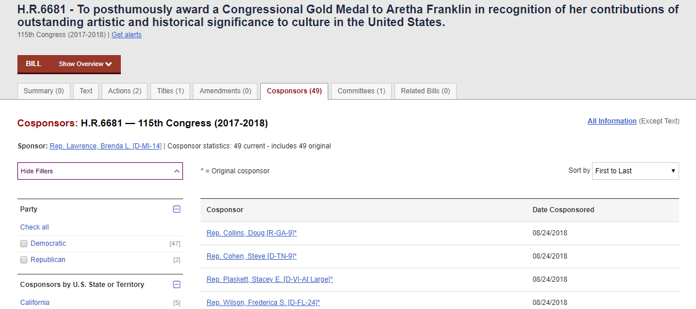
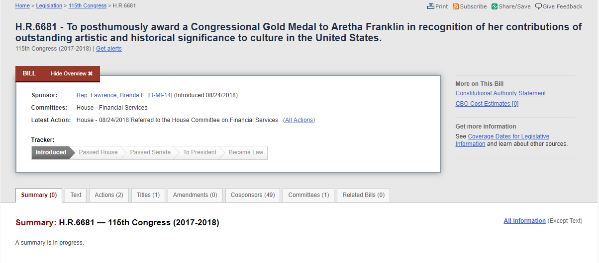

# Available Vignettes

1. [Robots.txt](robots.html)
2. [A Simple Scraping Exercises](simple_scrape.html)
3. [An Introduction to Web Scraping](main_lab.html)

```{r setup, include=FALSE}
knitr::opts_chunk$set(echo = TRUE, warning = FALSE, message = FALSE)
```
# And Then Things Got More Complicated

If you have arrived here after completing the main web scraping tutorial, great. You are ready to start this lab. If not, I highly recommend you start there first, otherwise you may feel a little lost. For the obstinate people that insist on starting here, you can load a prepackaged data set using `data('df_bills')`.

I will assume you are familiar with the data set.

```{r}
# libraries
require(tidyverse)
require(rvest)
require(how2scrape)

# Load toy data set
data('df_bills')
```

# Examining the Cosponsors Typical Page

The first step for extracting the names of cosponsors is to take a look at the typical cosponsor page and see what data we want to collect. Let's filter our data frame to only include bills with sponsors and take the link from the first observation.

```{r}
df_bills %>% 
  filter(N_cosponsors > 0) %>% 
  select(cosponsors_link) %>% 
  .[1, ]
```

Pop that into your browser. Here's my view (results may vary depending on whether you are using a prepackaged or freshly scraped data set):



It looks 49 legislators wants to show their R-E-S-P-E-C-T for Aretha. Good. There are two sets of potentially useful data on this page: the names of cosponsors and their date of cosponsorship. This opens up even more opportunities for creative analyses. Not only could we do some type of cosponsorship network analysis, we could also do some time-series analysis on rates of cosponsorship by bill, legislator, etc.

The extraction process is no different that before. Using the [SelectorGadget](https://selectorgadget.com/), highlight and isolate the cosponsor names, extract them using `rvest` and do the same for the date of cosponsorship.

```{r}
# Define typical page url
# Let's use a page with 2 cosponsors
# If the CSS selector works on all the names, it should work on just one 
url <- df_bills %>% 
  filter(N_cosponsors > 1) %>% 
  select(cosponsors_link) %>% 
  .[1, ]

# Read html

html.cosponsors <- read_html(url)

# Extract cosponsor name(s)
cosponsors <- html.cosponsors %>% 
  html_nodes('#main a') %>% 
  html_text()

# Extract date of cosponsorship
date_cosponsor <- html.cosponsors %>% 
  html_nodes('td.date') %>% 
  html_text()
```

Alright, it's fairly straightforward to get the data we want. However, there are two remaining issues. First, we have two vectors of data with length greater than one which we will ultimately want to append to a single observation. We could use list columns, but that makes later data manipulation more difficult. Avoid them if possible. We will need to decide how to collapse all this data in a way that can be intuitively expanded later (i.e. a long form data set). Second, we need to write this into a function with conditionals for one or greater cospsonsors. 

I have provided my solution below, but there are certainly others:
```{r, eval = F}
co_extractor <- function(url) {
  # Libaries
  require(rvest)
  require(dplyr)

  # Read html
  html.cosponsors <- read_html(url)

  # Extract cosponsor name(s)
  cosponsors <- html.cosponsors %>%
    html_nodes('#main a') %>%
    html_text()

  # Extract date of cosponsorship
  date_cosponsor <- html.cosponsors %>%
    html_nodes('td.date') %>%
    html_text()

  # Paste both vectors together
  # Separate by hypen for easy string splits later
  m <- paste(cosponsors, date_cosponsor, sep = ' - ')

  # If N_cosponsors > 1, collapse by semi-colon for easy string split later
  if (length(m) > 1) m <- paste(m, sep = '', collapse = '; ')
  if (length(m) == 0) m <- "No cosponsors"

  # Put in a random crawl-delay between 2 and 6
  d <- runif(1,2,6)
  Sys.sleep(d)

  return(m)

}
```

With the cosponsor extracting function all set, let's turn our attention to how to extract the text of each bill.

# Examining the Bill Text Typical Page

As we did above, print out the link of the first bill and see what it looks like. The typical page for the bill text is quite different from the other html structures we have encountered. 

```{r, echo = F}
df_bills$text_link[1]
```


You may notice the link doesn't actually take us to the text of the bill. Instead, we end up on a summary tab. Moving over to the text tab, I notice two things: 

1. The text of the bill is located at a different url than our stored links
2. Some bills do not have their text uploaded yet. 

The first issue is potentially very troublesome. We do not want to have to write a function that redirects us from the url we have to a different url. Consider that we have 10k links to work through, if we add an extra page to each of these we are talking about 20k urls to load! That will approximately double the execution time for no reason. Such needless cycling through pages puts unwanted stress on our computing resources and congress.gov's servers. Thankfully, there's an easy fix.

The links stored in our data frame and the desired links are almost identical:

> https://www.congress.gov/bill/115th-congress/house-bill/6681?r=1
> https://www.congress.gov/bill/115th-congress/house-bill/6681/text?format=txt&r=1

All we need to do is use some regex to substitute a '/text?format=txt&' after the bill number and we are good to go. My intuition with regex tells me that we shouldn't use a solely digits-based pattern because the 115th may interfere with it. We can solve this easily with `gsub()`:

```{r, eval = F}
df_bills <- df_bills %>% 
  mutate(text_link = gsub('(\\?)', '/text?format=txt&', text_link))
```

The second issue is less computationally problematic. Except for the newest bills, the rest should have their text uploaded. Nonetheless, we can't be sure this is true and we don't want to waste time extracting meaningless text. We need to find an intuitive and consistent proxy for whether a bill has text or not and, eventually, write this into a conditional statement in our text extracting function. 

I solved this by comparing bills with and without text. The bill text is stored in a '#billTextContainer' node. On the pages without text, this node is absent, and thus length==0. I use this as a proxy and write it into a conditional statement. By now, you should have a good idea of how to write a scraping function, so for the sake of space, I provide my text scraping function. I went through a multiple iterations of edits to get a function that captures most of the bills. The conditional statements are attempts to capture slight variations in bill structure across the frontier.

```{r, eval = F}
text_extractor <- function(url) {

  # Libraries
  require(rvest)
  require(dplyr)
  require(stringr)

  # Read html
  html <- read_html(url)

  # Create logical proxy for enrolled bill or not
  proxy_enrolled <- html %>%
    html_nodes('#textVersion') %>%
    html_text() %>%
    grepl('Enrolled',.) %>%
    {if (length(.)==0) . <- FALSE else .}

    if (proxy_enrolled) {

      text <- html %>%
        # extract text of bill
        html_nodes('#billTextContainer') %>%
        html_text() %>%
        # Second check to ensure ther
        # Split into meaningful parts
        str_split(., '\n{2}') %>%
        .[[1]] %>%
        # drop blank elements
        .[. != ''] %>%
        # Drop everything prior to start of main text
        .[-(1:grep('An Act', .)[1])] %>%
        # Remove excess white space
        str_replace_all('[\n\t]', '') %>%
        trimws()

    } else {

      # Extract text
      text <- html %>%
        html_nodes('#billTextContainer') %>%
        html_text() %>%
        # Check to ensure there is text
        { if (length(.) > 0) . <-
            # Split into meaningful parts
            str_split(., '\n{2}') %>%
            .[[1]] %>%
            # Drop blank elements
            .[. != ''] %>%
            # Drop everything prior to start of main text
            .[-(1:grep('BILL|ACT|AMENDMENTS', .)[1])] %>%
            # remove excess white space
            str_replace_all('[\n\t]', '') %>%
            trimws() else . <- "No text available"
            }
    }

  # Put in a random crawl-delay between 2 and 6
  d <- runif(1,2,6)
  Sys.sleep(d)

  return(text)

}
```

Most of the function consists of string cleaning commands. The resulting text will still be a bit unstructured/messy due to variation across each bill, but it should get us close to what we want. With both these functions in place, we can move to the actual scraping process. 

Unlike the initial bill scrape, this is a much larger operation due to the total number of pages. If we tried to execute this by sequentially mapping the two functions over their respective list of links, it would take approximately `r {round((2 * nrow(df_bills) * 1.5) / 3600, 2)}` hours (assuming 1.5 sec/link)! And that's a minimal estimate... To speed things up, I utilized a suite of parallel processing packages---`foreach`, `doParallel`, and `parallel`---and sent the script to the [BSOS HPC cluster](https://oacs.umd.edu/oacs-cloud/bsos-high-performance-computing-cluster). The script is available in the `how2scrape` package directory './ext_scripts' or from my [github](https://github.com/EandrewJones/how2scrape/blob/master/ext_scripts/hpc_wslab.R). The resulting data frame is stored in the packaged as 'co_text'. As a final step, let's open it up and append the data to our primary data frame.

```{r, eval = F}
# Load data
data('co_text')

# Append cosponsors and text to df_bills use map
df_bills <- df_bills %>% 
  mutate(cosponsors = bill_container %>%
           map(1) %>%
           unlist(),
         text = bill_container %>% 
           map(2)) %>% 
  select(1:5, 
         cosponsors, 
         text, 
         cosponsors_link, 
         text_link)
```

And with that, we have detailed information on over 10,000 bills from the current session of Congress. Go forth and scrape.

[Return to 'An Introduction to Web Scraping'](main_lab.html)
