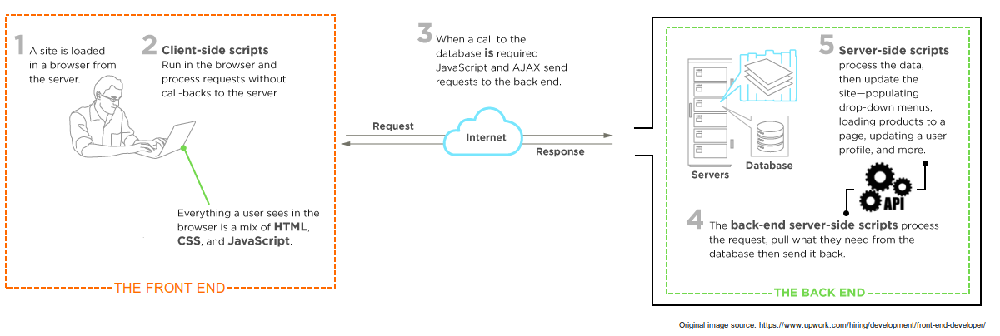

# Available Vignettes

1. [Robots.txt](robots.html)
2. [Web Scraping](web_scraping.html)
3. [A Simple Scraping Exercise](simple_scrape.html)
4. [How to Extract Bill Cosponsors and Text](cosponsors.html)
5. [Accessing APIs](api.html)

```{r setup, include=FALSE}
knitr::opts_chunk$set(echo = TRUE, warning = FALSE, message = FALSE, cache = TRUE)
```
# Web Scraping: A Mercurial Beast

When it comes to web scraping, there is good news and bad news. 

The good news is the fundamentals of scraping are simple and `R` offers an array of great tools to assist us. Once you master, or become conversant in, a few packages---`rvest` (the go-to html parser in `R`), `httr`, and `rjson` or `jsonlite` (for API interfacing)---you are ready to tackle almost any web scraping task. For large web crawling endeavors or really difficult to parse objects, such as D3.js visualizations, other languages (java, python, etc.) may be better or necessary. Fortunately, `R` should meet 99 percent of one's basic needs.

The bad news is that there is no cookie-cutter solution for web scraping. Websites are idiosyncratic beasts, with their underlying code ranging in quality and structure. Some sites look clean on the surface, but are riddled with invisible javascript and other structures that will derail your scraper, intentionally or not. Thus, the best we can do is cover the basics andtailor our scripts to the specific task, addressing problems as they arise.

# Web Scraping Etiquette

Before starting, it's pertinent to understand how websites and their underlying servers work as well as some basic etiquette we should follow when scraping data from them.

Each call to a web server takes time, server cycles, and memory. Most servers can handle significant traffic, but cannot necessarily handle the strain induced by massive automated requests. An overzealous scraper can overload a server. Servers may interpret this as a *Denial of Service Attack* (DOS). 

We do not want to be seen as committing a DOS for a couple reasons. First, such an overload can crash a server and keep other users from accessing the website. Second, servers can and will implement countermeasures (i.e. block our access from our IP and so on). We will cover ways to keep our scrapers from being seen as committing this type of attack.

If you want to build a crawler---continuously extract data from a website or group of websites in real time or anytime some change occurs---there are some additional considerations. Below is a list of best practices:

1. Respect the [robots.txt](robots.html)
2. Do not hit servers too frequently
    + Slows down service for humans
    + Bots are lower priority
3. Find reliable source sites
    + Logical navigation
    + Consistent links
4. Do not scrape during peak hours
    + Determined by geo-location
    + Improves speed of your scrape
5. Use data responsibly
    + Usually not applicable for academic use
    + Regardless, make sure you are in compliance with website's Terms of Service
    
# What's in a Website and How Do We Extract It?

All websites can be broken down into two main parts:

1. **The front-end**
    + What the user sees and interacts with in the browser
    + Structures information via HTML, CSS, and Javascript
    + May or may not expose an application programming interface (API) to database
2. **The back-end**
    + A remote computer (or cluster) that services user requests (i.e. the server)
    + Structures website via a web framework such as Ruby, Django, Angular, Flask, etc.
    + Stores dynamic data in *SQL database*
    + Likely utilizes an API to service calls to the database

A well-designed website is like an iceberg---the front-end is the small tip above the surface while the back-end is everything hidden under the water. Most of the heavy-lifting is hidden from site, and an efficient, minimal interface is displayed to the user. 



Before pulling out the scalpel and scraping a website to shreds, make sure there is not a more efficient option available. There are three possible cases for getting data from the web:

1. You can directly access to the database 
2. You can access the database via an API
3. You can only access the database via the front-end

The first choice, direct database access, is ideal since it entail unrestricted direct access to source of your desired information. There are no layers of abstraction or restrictions on what you can get. However, this is also an extremely rare situation. Unrestricted access would entail a major security breach for most websites, potentially exposing private user data to the public. If you manage to find a way to directly access a website's database via the front-end, as a good citizen you should contact the administrators and inform them of the security risk.

The second choice, indirect database access via an api, is the sweet spot. This is a structured way to make requests to the database that is designed by the website developers so as to ensure security. Most websites utilize APIs in the back-end to service requests. However, many websites do not expose their API to the public. Others do expose the API to the user, but finding the connection request in your network traffic monitor can be difficult. Finally, some websites explicitly offer public-facing APIs for developers to interact with, e.g. [Twitter](https://developer.twitter.com/en/docs/twitter-api),  [Facebook graph API](https://developers.facebook.com/docs/graph-api/), [US GPO](https://github.com/usgpo/api) ,etc.

The third choice, database access via the front-end, is what comes to mind when most people think of web scraping. This entails making a request to the page where our sought after info lives, parsing through the returned document which is a combination of HTML, CSS, and Javascript, extracting the information, storing it somewhere. If our desired information lives across more than one page, then we must iterate this process until we have collected everything. Web scraping is tedious and time-consuming, but unfortunately the most common situation.

This lab focuses on web scraping and APIs since they are the most common. Below you proceed to either.

# [Web Scraping](web_scraping.html) or [Accessing APIs](api.html)
