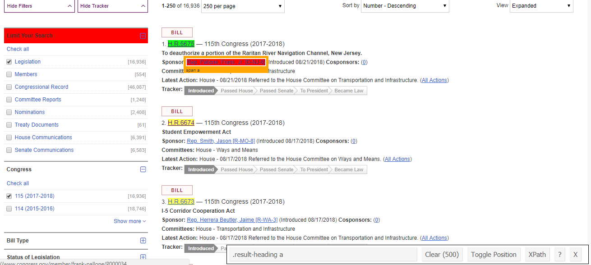
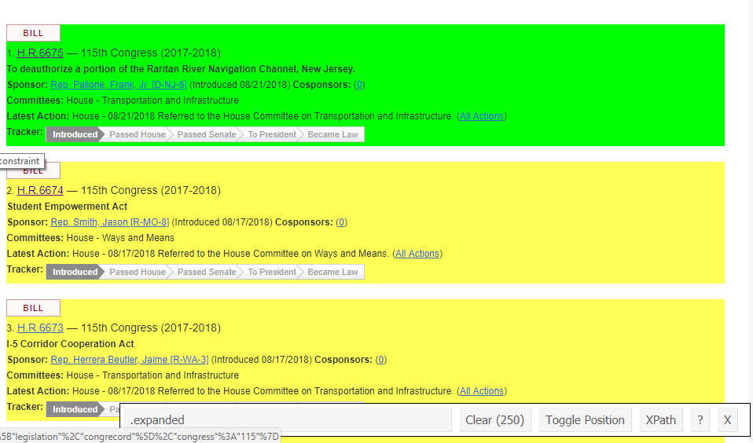

```{r setup, include=FALSE}
knitr::opts_chunk$set(echo = TRUE, warning = FALSE, message = FALSE)
```

When it comes to web scraping, there is good news and bad news. 

The good news is the fundamentals of scraping are simple and `R` offers an array of great tools to assist us. Once you master, or become conversant in, a few packages---`rvest` (the go-to html parser in `R`), `httr`, and `rjson` or `jsonlite` (for API interfacing)---you are ready to tackle almost any web scraping task. For large web crawling endeavors or really difficult to parse objects, such as D3.js visualizations, other languages (java, python, etc.) may be better or necessary. Fortunately, `R` should meet 99 percent of one's basic needs.

The bad news is that there is no cookie-cutter solution for web scraping. Websites are idiosyncratic beasts, with their underlying code ranging in quality and structure. Some sites look clean on the surface, but are riddled with invisible javascript and other structures that will derail your scraper, intentionally or not. Thus, the best we can do is cover the basics andtailor our scripts to the specific task, addressing problems as they arise.

# Web Scraping Etiquette

Before starting, it's pertinent to understand how websites and their underlying servers work as well as some basic etiquette we should follow when scraping data from them.

Each call to a web server takes time, server cycles, and memory. Most servers can handle significant traffic, but cannot necessarily handle the strain induced by massive automated requests. An overzealous scraper can overload a server. Servers may interpret this as a *Denial of Service Attack* (DOS). 

We do not want to be seen as committing a DOS for a couple reasons. First, such an overload can crash a server and keep other users from accessing the website. Second, servers and hosters can and will implement countermeasures (i.e. block our access from our IP and so on). We will cover ways to keep our scrapers from being seen as committing this type of attack.

If you want to build a crawler---continuously extract data from a website or group of websites in real time or anytime some change occurs---there are some additional considerations. Below is a list of best practices:

1. Respect the [robots.txt](robots.html)
2. Do not hit servers too frequently
    + Slows down service for humans
    + Bots are lower priority
3. Find reliable source sites
    + Logical navigation
    + Consistent links
4. Do not scrape during peak hours
    + Determined by geo-location
    + Improves speed of your scrape
5. Use data responsibly
    + Usually not applicable for academic use
    + Regardless, make sure you are in compliance with website's TOS
    
# What's in a Website and How Do We Extract It?

Almost all web pages have three things under the hood:

1. Model - A database
2. View - A web server
3. Controller - A piece of code that receives requests and constructs pages on demand

Before pulling out the scalpel and dissecting a web page to shreds, make sure there is not a more efficient option available. There are three general strategies for getting data from the web (from best to worst):

1. You get access to the model, e.g. database connection 
2. You get access to the controller via an API
3. You get your information from the view, i.e. web scraping

Today, we will focus on option 3. I intend to add a lab on how to use APIs in `R` (and eventually `Python`) in the future. In the meantime, if you want to learn how to work with APIs, here are two good blog posts: [[1](https://tclavelle.github.io/blog/r_and_apis/)]  [[2](https://tophcito.blogspot.com/2015/11/accessing-apis-from-r-and-little-r.html)]

So what is behind the view we see in our web browser? Typically, it's a combination of HTML (XML) and javascript. If you've never seen HTML, here is an example:

~~~
<html>
<head>
  <title> Michael Cohen's Email </title>
  <script>
    var foot = bar;
  <script>
</head>
<body>
  <div id="payments">
  <h2>Second heading</h2>
  <p class='slick'>information about <br/><i>payments</i></p>
  <p>Just <a href="http://www.google.com">google it!</a></p>
  <table>
~~~

We can use html's tree structure of tags and attributes to locate the desired information and feed this information to an XML parser, i.e. `rvest`. Normally, identifying the tags and attributes requires reading through the source code of the web page. Fortunately, there is an amazing tool called the [SelectorGadget](https://selectorgadget.com/) that will identify the perfect [CSS selector](https://www.w3.org/TR/CSS2/selector.html) for us to extract what we need. Please download and install the SelectorGadget now if you have not already.

Most websites will also contain javascript which tells the browser how to visually structure the page. Javascript makes websites easily digestable for human consumers, but can cause problems for scrapers.

# Strategy for Building Your Web Scraper

The best coding strategy for writing and scaling up a web scraper depends on your needs. Perhaps you need only extract information from one strucutre (e.g. a table) on one web page. If so, you are in luck as the code to execute such a task is simple (see [here](simple_scrape.html) for an example). However, for more interesting and challenging projects, we should conceptualize the website as consisting of two things: a *typical page* and the *frontier*.

A *typical page* is the page containing the information we want to extract. The *frontier* lists all of the typical pages we seek to scrape. Sometimes websites contain a page listing the data we'd like to scrape. Other times the frontier is the result from a search query. Once we have identified the typical page and frontier, we figure out how to extract the data we want from the former and iterate over the latter. Ideally, the typical page is consistently structured across the frontier so that our algorithm maps smoothly. 

Let's dig into a tangible example.

# Scraping Congress.gov

Perhaps we are interested in gathering information about legislation introduced into the current session of Congress. The first step is to identify our typical page. Go to www.congress.gov > Advanced Searches  and refine the query to contain only Bills (H.R. or S.) from the 115<sup>th</sup> Congress (2017-2018). Additionally, ask the query to show 250 results per page. Here's the [link](https://www.congress.gov/search?q={%22source%22:%22legislation%22,%22congress%22:%22115%22,%22type%22:%22bills%22}&pageSize=250) for your convenience. With a typical page in hand, we need to decide what information we want to extract. I intend to store the following:

1. Bill number
2. Short title
3. Sponsor
4. Number of cosponsors
5. Cosponsor names
6. Committees
7. Text of the bill

Most of this information is on our typical page and so is easy to extract. However, cosponsor names and the text of the bill are on separate typical pages over which we'll need to individually enumerate. Altogether, this makes for three typical pages and frontiers. Let's begin with the first typical page.

```{r}
# libraries

  # HTML parser
  require(rvest)

  # Data manipulation
  require(tidyverse)

  # String cleaning
  require(stringr)

# Set url 

url <- 'https://www.congress.gov/search?q={%22source%22:%22legislation%22,%22congress%22:%22115%22,%22type%22:%22bills%22}&pageSize=250'

# Read in page

html.legislation <- read_html(url)

# Extract the bill number

bill_number <- html.legislation %>% 
  html_nodes('.result-heading a') %>% 
  html_text()

```

Hold up! Each bill number is listed twice... What's going on? Alas, it's our old arch nemesis, javascript! If you look at the source code of this page, you will find that each bill is duplicated. Our browser only shows the content rendered visible by javascript, but rvest reads in both. What to do?

As the StackOverflow gods will tell you, the most correct solution for creating scalable, robust crawlers is to use a headless WebKit scriptable such as `PhantomJS` with a Selenium (`RSelenium`) backend server. There is a high startup costs to get these tools running correctly, so if you face a problem requiring these come talk with me. Otherwise, there's a simpler solution.

Moving back to the open browser and SelectorGadget, you'll notice that when you isolate the title's the SelectorGadget indicates 500 items are selected (see parentheses). Thus, we know the hidden elements are captured too. 

 

However, if we click the entire bill block, only 250 are selected.



SelectorGadget tells us that these nodes are identified by the '.expanded' css. It's very likely, then, that all the identifiers we want to use are nested within this css. Let's try:

```{r}
# Extract the bill number

bill_number <- html.legislation %>% 
  html_nodes('.expanded .result-heading a') %>% 
  html_text()
```

Our hunch was correct. We now have a vector of bill numbers with length 250. Rinse and repeat to extract the rest of the data. A quick note on `rvest` functions: to extract text, use `html_text()`; to extract the link for hyperlinked text, use `html_attrs()` and `unlist` the resulting object. 

```{r}
# Extract link to bill text

text_link <- html.legislation %>% 
  html_nodes('.expanded .result-heading a') %>% 
  html_attrs() %>% 
  unlist() %>% 
  unname()

# Extract short title

short_title <- html.legislation %>% 
  html_nodes('.expanded .result-title') %>% 
  html_text()

# Extract sponsor

sponsor <- html.legislation %>% 
  html_nodes('.result-title+ .result-item a:nth-child(2)') %>% 
  html_text()

# Extact number of co-sponsors

N_cosponsors <- html.legislation %>% 
  html_nodes('.expanded .result-item a~ a') %>% 
  html_text() %>% 
  as.numeric()

# Extact link to co-sponsor names

cosponsors_link <- html.legislation %>% 
  html_nodes('.expanded .result-item a~ a') %>% 
  html_attrs() %>% 
  unlist() %>% 
  unname()

# Extract committee

committee <- html.legislation %>% 
  html_nodes('.expanded .result-item:nth-child(5)') %>% 
  html_text() %>% 
  str_replace_all(pattern = "\n", replacement = "") %>%
  str_replace_all(pattern = "Committees:", replacement = "") %>% 
  trimws()

df_bills <- data.frame(bill_number, 
                       short_title,
                       sponsor,
                       N_cosponsors,
                       committee,
                       cosponsors_link,
                       text_link,
                       stringsAsFactors = F)
```

Now that we have the code to extract what we want from typical page, we should write this into a function that we can then map over the frontier. To save time and headaches, I have provided a debugged function below that accounts for idiosyncrasies from other pages that break a loop based solely on the code above. Trial and error is unavoidable when scraping. You will have to write a generic function, map it across the frontier, see what errors arise, and tweak your code from there. If you want to see my debugging process in-depth, go [here](https://github.com/EandrewJones/how2scrape/blob/master/ext_scripts/debug_bill_extractor.R)

```{r}
# Function to extract data from typical page

bill_extractor <- function(url) {
  
  # Libraries
  require(rvest, quietly = T)
  require(dplyr, quietly = T)
  require(stringr, quietly = T)

  # Read in page
  html.legislation <- read_html(url)
  
  # Extract short title
  short_title <- html.legislation %>% 
    html_nodes('.expanded .result-title') %>% 
    html_text() %>% 
    str_remove_all('\\\\"')
  
  # Some bills are entitled 'Reserved for the Minority Leader.' or 'Reserved for the Speaker."
  # They do not offer any other info and break our function if we do not remove them. 
  # Save their position to remove
  r <- which(short_title=="Reserved for the Minority Leader." | short_title=="Reserved for the Speaker.")
  short_title <- short_title %>% 
  {if(length(r) > 0) .[-r] else .}
  
  # Extract the bill number
  bill_number <- html.legislation %>% 
    html_nodes('.expanded .result-heading a') %>% 
    html_text() %>% 
    # Drop those reserved for minority leader/speaker
    {if(length(r) > 0) .[-r] else .}
  
  # Extract link to bill text
  text_link <- html.legislation %>% 
    html_nodes('.expanded .result-heading a') %>% 
    html_attrs() %>% 
    unlist() %>% 
    unname() %>% 
    {if(length(r) > 0) .[-r] else .}
    
  # Extract sponsor
  sponsor <- html.legislation %>% 
    html_nodes('.result-title+ .result-item a:nth-child(2)') %>% 
    html_text()

  # Extract number of co-sponsors
  N_cosponsors <- html.legislation %>% 
    html_nodes('#main .expanded a~ strong+ a') %>% 
    html_text() %>% 
    as.numeric 
  
  # occassionally grabs extra elements such as ammendments and introduces NA's into vector when
  # converted to numeric, we need to remove these but first store their position in the vector so we can
  # remove their associated hyperlinks
  k <- which(!is.na(N_cosponsors))
  N_cosponsors <- N_cosponsors[k]

  # Extract link to co-sponsor names
  cosponsors_link <- html.legislation %>% 
    html_nodes('#main .expanded a~ strong+ a') %>% 
    html_attrs() %>% 
    unlist() %>% 
    unname() %>% 
    .[k]

  # Extract committee
  committee <- html.legislation %>% 
    html_nodes('.expanded .result-item:nth-child(5)') %>% 
    html_text() %>% 
    str_replace_all(pattern = "\n", replacement = "") %>%
    str_replace_all(pattern = "Committees:", replacement = "") %>% 
    trimws()
  
  # Store as df
  df_bills <- data.frame(bill_number, 
                         short_title,
                         sponsor,
                         N_cosponsors,
                         committee,
                         cosponsors_link,
                         text_link,
                         stringsAsFactors = F)
  
  # Assign df_bills to global environment
  assign('df_bills',
         value = df_bills,
         envir = .GlobalEnv)
}
```

Before we can map over the frontier, we need to define it as an object. Scroll to the bottom of the congress.gov page and click to page 2. Notice the change in the url in your browser's address bar? It now ends in a *&page=2*. We can capitalize on this to produce a vector of urls from 1 to N<sub>pages</sub>. How do we figure out N<sub>pages</sub>? One way would be to divide N<sub>bills</sub> by the number visible per page (250). *Don't do this*! Why? We are scraping from the current session of Congress, so N<sub>pages</sub> changes on a daily basis. Below is one way to account for the changing number of bills:

```{r}
# Extract the total bill count using rvest

N_bills <- html.legislation %>% 
  html_nodes('#facetItemsourceLegislationcount') %>% 
  html_text() %>% 
  str_remove_all("\\[|\\]|,") %>% 
  as.numeric()

# Calculate the total number of pages

N_pages <- ceiling(N_bills / 250)

# Enumerate frontier by pasting the prefix url and seq of N_pages together

frontier <- paste0('https://www.congress.gov/search?q={"source":"legislation","congress":"115","type":"bills"}&pageSize=250&page=', seq(1,N_pages))
```

With the frontier in vector format, we are ready to put our scraper into operation. There a couple of options for doing so. One option is to loop over our function. However, `R` is a functional language and does not like loops. A second option is to use a function like `lapply`. However, this is bound to be slow given how much data we are scraping. To speed things up a lot, we can capitalize on `furrr`, a package that combines the multiprocessing power of the `future` package with `purrr`'s family of map functions. As an added bonus, `furrr` plays nicely with `dplyr`.

```{r}
# For multiprocessing our map across the frontier
require(furrr)

# Initiate future
plan(multiprocess)

# Map across frontier
df_bills <- frontier %>% 
  future_map(., bill_extractor) %>% 
  # we have a list of data frames now
  # combine into single df using plyr::rbind.fill()
  plyr::rbind.fill()
```

And just like magic we have a data frame with all the bills from the 115<sup>th</sup> Congress. There's a small discrepancy between the length of the data frame and N_bills, suggesting a few bills fell in between the cracks. Most likely, these are the "Reserved for the Minority Leader/Speaker" bills. Overall, achieving `r {round((nrow(df) / N_bills) * 100, 2)}` percent coverage isn't too shabby! 

```{r, echo=F}
# Preview table
require(knitr)
require(kableExtra)
df_bills %>% 
  sample_n(500) %>% 
  kable() %>% 
  kable_styling(bootstrap_options = c('striped', 'hover', 'condensed'),
                font_size = 12) %>% 
  scroll_box(width = '100%',
             height = '350px')
```

With the primary data set in hand, I will conclude the main lab. With the links to the cosponsor  and text pages included in the data frame, it is easy to write an additional scraping function to extract these data. If you are interested in seeing how this is done or simply want more practice with scrapers follow the link below.


# [How to Extract Bill Cosponsors and Text](cosponsors.html)

