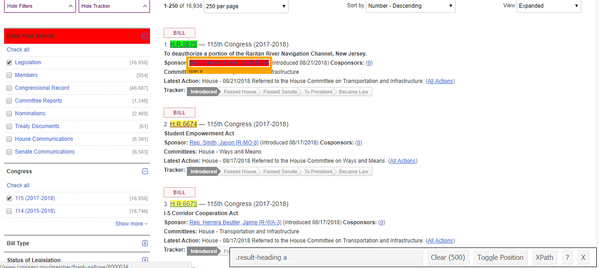

# Available Vignettes

1. [Introduction](introduction.html)
2. [Robots.txt](robots.html)
3. [A Simple Scraping Exercises](simple_scrape.html)
4. [How to Extract Bill Cosponsors and Text](cosponsors.html)
5. [Accessing APIs](api.html)

```{r setup, include=FALSE}
knitr::opts_chunk$set(echo = TRUE, warning = FALSE, message = FALSE, cache = TRUE)
```

# The Front-end Ingredients

So what is behind the view we see in our web browser? 

Typically, every modern website is a combination of HTML, CSS and Javascript. HTML stands for *Hyper Text Markup Language* and functions just as it's named--it is a markup language much like R markdown that structures the placement/organizing of text on the page. CSS stands for *Cascading Style Sheets* and serves to "dress-up" the HTML in a way the is both aesthetically pleasing and practical for the user. Javascript is a front-end scripting language that can handle certain requests to the back-end, improve user experience through expanded functionality (think drop down menus, (un)hiding content, etc.), and update information without reloading a page. Although Javascript vastly improves general user experience, it can become quite the monkey wrench when web scraping since it operates dynamically in the browser and most web scraping frameworks operate by parsing a static HTML file. 

If you've never seen HTML, here is an example:

We capitalize on HTML's tree structure to isolate the nodes containing our desired information and point the HTML parser, i.e. `rvest`, to the node. We identify a given node by its CSS selector. Here is some corresponding CSS for the same website:


Normally, identifying the tags and attributes requires reading through the source code of the web page. Fortunately, there are a couple amazing tools, namely [SelectorGadget](https://selectorgadget.com/) (for Chrome) and [ScrapeMate](https://addons.mozilla.org/en-US/firefox/addon/scrapemate/) (for Firefox), that will identify the perfect CSS selector for us to extract what we need. Please download and install one of these tools now if you have not already.


# Strategy for Building Your Web Scraper

The best coding strategy for writing and scaling up a web scraper depends on your needs. Perhaps you need only extract information from one structure (e.g. a table) on one web page. If so, you are in luck as the code to execute such a task is simple (see [here](simple_scrape.html) for an example). However, for more interesting and challenging projects, we should conceptualize the website as consisting of two things: a *typical page* and the *frontier*.

A *typical page* is the page containing the information we want to extract. Before we start writing code based on a given page, we want to first ensure that the page we are referencing is indeed typical. In other words, we need to ask ourselves: do the majority of pages I will be scraping look the this one? 

The *frontier* lists all of the pages we seek to scrape. Sometimes websites contain a page listing the data we'd like to scrape. Other times the frontier is the result from a search query. Once we have identified the typical page and frontier, we figure out how to extract the data we want from the former and iterate over the latter. Ideally, the typical page is consistently structured across the frontier so that our algorithm scales smoothly. 

Let's dig into a tangible example.

# Scraping Congress.gov

Perhaps we are interested in gathering information about legislation introduced into the current session of Congress. The first step is to identify our typical page. Go to www.congress.gov > Advanced Searches  and refine the query to contain only Bills (H.R. or S.) from the 115<sup>th</sup> Congress (2017-2018). Additionally, ask the query to show 250 results per page. Here's the [link](https://www.congress.gov/search?q={%22source%22:%22legislation%22,%22congress%22:%22115%22,%22type%22:%22bills%22}&pageSize=250) for your convenience. With a typical page in hand, we need to decide what information we want to extract. I intend to store the following:

1. Bill number
2. Short title
3. Sponsor
4. Number of cosponsors
5. Cosponsor names
6. Committees
7. Text of the bill

Most of this information is on our typical page and so is easy to extract. However, cosponsor names and the text of the bill are on differently formatted pages over which we'll need to individually enumerate. Altogether, this makes for three typical pages and frontiers. Let's begin with the first typical page.

```{r}
# libraries
require(rvest) # HTML Parser
require(tidyverse) # Data manipulation
require(stringr) # String cleaning
  
# Set url 

url <- 'https://www.congress.gov/search?q={%22source%22:%22legislation%22,%22congress%22:%22115%22,%22type%22:%22bills%22}&pageSize=250'

# Read in page

html.legislation <- read_html(url)

# Extract the bill number

bill_number <- html.legislation %>% 
  html_nodes('.result-heading a') %>% 
  html_text()

```

Hold up! Each bill number is listed twice... What's going on? If you look at the source code of this page, you will find that each bill is duplicated. Our browser only shows the bills nested in the "expanded" class, but there is also a hidden "compact" class. Which class gets activate likely depends on the type of device (mobile vs PC) that's accessing the page. Regardless, we have duplicates, and we need to isolate just one of these containers. What to do?

Moving back to the open browser and SelectorGadget, you'll notice that when you isolate the title's the SelectorGadget indicates 500 items are selected (see parentheses). Thus, we know the hidden elements are captured too. 

 

However, if we click the entire bill block, only 250 are selected.


SelectorGadget tells us that these nodes are identified by the '.expanded' css. It's very likely, then, that all the identifiers we want to use are nested within this css. Let's try:

```{r}
# Extract the bill number

bill_number <- html.legislation %>% 
  html_nodes('.expanded .result-heading a') %>% 
  html_text()
```

Our hunch was correct. We now have a vector of bill numbers with length 250. Rinse and repeat to extract the rest of the data. A quick note on `rvest` functions: to extract text, use `html_text()`; to extract the link for hyperlinked text, use `html_attrs()` and `unlist` the resulting object. 

```{r}
# Extract link to bill text

text_link <- html.legislation %>% 
  html_nodes('.expanded .result-heading a') %>% 
  html_attrs() %>% 
  unlist() %>% 
  unname()

# Extract short title

short_title <- html.legislation %>% 
  html_nodes('.expanded .result-title') %>% 
  html_text()

# Extract sponsor

sponsor <- html.legislation %>% 
  html_nodes('.result-title+ .result-item a:nth-child(2)') %>% 
  html_text()

# Extact number of co-sponsors

N_cosponsors <- html.legislation %>% 
  html_nodes('.expanded .result-item a~ strong+ a') %>% 
  html_text() %>% 
  as.numeric()

# Extact link to co-sponsor names

cosponsors_link <- html.legislation %>% 
  html_nodes('.expanded .result-item a~ strong+ a') %>% 
  html_attrs() %>% 
  unlist() %>% 
  unname()

# Extract committee

committee <- html.legislation %>% 
  html_nodes('.expanded .result-item:nth-child(5)') %>% 
  html_text() %>% 
  str_replace_all(pattern = "\n", replacement = "") %>%
  str_replace_all(pattern = "Committees:", replacement = "") %>% 
  trimws()

df_bills <- data.frame(bill_number, 
                       short_title,
                       sponsor,
                       N_cosponsors,
                       committee,
                       cosponsors_link,
                       text_link,
                       stringsAsFactors = F)
```

Now that we have the code to extract what we want from typical page, we should write this into a function that we can then map over the frontier. To save time and headaches, I have provided a debugged function below that accounts for idiosyncrasies from other pages that break a loop based solely on the code above. Trial and error is unavoidable when scraping. You will have to write a generic function, map it across the frontier, see what errors arise, and tweak your code from there. If you want to see my debugging process in-depth, go [here](https://github.com/EandrewJones/how2scrape/blob/master/ext_scripts/debug_bill_extractor.R)

```{r}
# Function to extract data from typical page

bill_extractor <- function(url) {
  
  # Libraries
  require(rvest, quietly = T)
  require(dplyr, quietly = T)
  require(stringr, quietly = T)

  # Read in page
  html.legislation <- read_html(url)
  
  # Extract short title
  short_title <- html.legislation %>% 
    html_nodes('.expanded .result-title') %>% 
    html_text() %>% 
    str_remove_all('\\\\"')
  
  # Some bills are entitled 'Reserved for the Minority Leader.' or 'Reserved for the Speaker."
  # They do not offer any other info and break our function if we do not remove them. 
  # Save their position to remove
  r <- which(short_title=="Reserved for the Minority Leader." | short_title=="Reserved for the Speaker.")
  short_title <- short_title %>% 
  {if(length(r) > 0) .[-r] else .}
  
  # Extract the bill number
  bill_number <- html.legislation %>% 
    html_nodes('.expanded .result-heading a') %>% 
    html_text() %>% 
    # Drop those reserved for minority leader/speaker
    {if(length(r) > 0) .[-r] else .}
  
  # Extract link to bill text
  text_link <- html.legislation %>% 
    html_nodes('.expanded .result-heading a') %>% 
    html_attrs() %>% 
    unlist() %>% 
    unname() %>% 
    {if(length(r) > 0) .[-r] else .}
    
  # Extract sponsor
  sponsor <- html.legislation %>% 
    html_nodes('.result-title+ .result-item a:nth-child(2)') %>% 
    html_text()

  # Extract number of co-sponsors
  N_cosponsors <- html.legislation %>% 
    html_nodes('#main .expanded a~ strong+ a') %>% 
    html_text() %>% 
    as.numeric 
  
  # occasionally grabs extra elements such as amendments and introduces NA's into vector when
  # converted to numeric, we need to remove these but first store their position in the vector so we can
  # remove their associated hyperlinks
  k <- which(!is.na(N_cosponsors))
  N_cosponsors <- N_cosponsors[k]

  # Extract link to co-sponsor names
  cosponsors_link <- html.legislation %>% 
    html_nodes('#main .expanded a~ strong+ a') %>% 
    html_attrs() %>% 
    unlist() %>% 
    unname() %>% 
    .[k]

  # Extract committee
  committee <- html.legislation %>% 
    html_nodes('.expanded .result-item:nth-child(5)') %>% 
    html_text() %>% 
    str_replace_all(pattern = "\n", replacement = "") %>%
    str_replace_all(pattern = "Committees:", replacement = "") %>% 
    trimws()
  
  # Store as df
  df_bills <- data.frame(bill_number, 
                         short_title,
                         sponsor,
                         N_cosponsors,
                         committee,
                         cosponsors_link,
                         text_link,
                         stringsAsFactors = F)
  return(df_bills)
  # Assign df_bills to global environment
  # assign('df_bills',
  #        value = df_bills,
  #        envir = .GlobalEnv)
  
}
```

Before we can map over the frontier, we need to define it as an object. Scroll to the bottom of the congress.gov page and click to page 2. Notice the change in the url in your browser's address bar? It now ends in a *&page=2*. We can capitalize on this to produce a vector of urls from 1 to N<sub>pages</sub>. How do we figure out N<sub>pages</sub>? One way would be to divide N<sub>bills</sub> by the number visible per page (250). *Don't do this*! Why? We are scraping from the current session of Congress, so N<sub>pages</sub> changes on a daily basis. Below is one way to account for the changing number of bills:

```{r}
# Extract the total bill count using rvest

N_bills <- html.legislation %>% 
  html_nodes('#facetItemsourceLegislationcount') %>% 
  html_text() %>% 
  str_remove_all("\\[|\\]|,") %>% 
  as.numeric()

# Calculate the total number of pages

N_pages <- ceiling(N_bills / 250)

# Enumerate frontier by pasting the prefix url and seq of N_pages together

frontier <- paste0(url, '&page=', seq(1,N_pages))
```

With the frontier in vector format, we are ready to put our scraper into operation. There a couple of options for doing so. One option is to loop over our function. However, `R` is a functional language and does not like loops. A second option is to use a function like `lapply`. However, I prefer `purrr`'s family of map functions because they play nicely with `dplyr`. More importantly, purrr comes with a few safe-guard utilities, namely the `quietly()`, `safely()`, and `possibly()` functions. These are *crucial* when scraping large amounts of data.

Imagine you start your script in the evening, go to bed, and come back in the morning only to find it ran for a little bit and then crashed upon encountering an edge case. Time and computing sources wasted! Instead, we want the function to take note of the error but continue on. We can wrap our scraping function in one of these functions, and they will allow our code to continue operating even if it encounters an exception. The only difference is how the take note of the error. I generally prefer `possibly()`.


```{r}
require(purrr)

# Safeguard scraper
.bill_extractor <- possibly(bill_extractor, otherwise = NULL)

# Map across frontier
df_bills <- frontier %>% 
  map_dfr(., .bill_extractor) 
```

And just like magic we have a data frame with all the bills from the 115<sup>th</sup> Congress. There's a small discrepancy between the length of the data frame and N_bills, suggesting a few bills fell in between the cracks. Most likely, these are the "Reserved for the Minority Leader/Speaker" bills. Overall, achieving `r {round((nrow(df_bills) / N_bills) * 100, 2)}` percent coverage isn't too shabby! 

```{r, echo=F}
# Preview table
require(knitr)
require(kableExtra)
df_bills %>% 
  head(500) %>%  
  kable() %>% 
  kable_styling(bootstrap_options = c('striped', 'hover', 'condensed'),
                font_size = 12) %>% 
  scroll_box(width = '100%',
             height = '350px')
```

With the primary data set in hand, we can stop here. Further information about the cosponsors and bill text can be gather by scraping these pages via their respective links in the data frame. We just need to employ the same strategy we did here. If you are interested in seeing how this is done or simply want more practice with scrapers follow the link below.


# [How to Extract Bill Cosponsors and Text](cosponsors.html)


